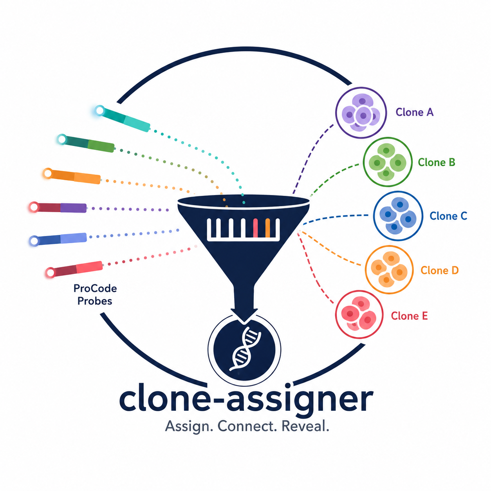

# clone-assigner

<p align="center">

  

</p>


A flexible and reproducible clone assignment framework based on Decision Trees for ProCode/Combinatorial Barcoding single cell settings.

`clone-assigner` assigns clone identities to single cells using combinatorial ProCodes. The package supports two approach for permissive and strict assignments, multi-sample batch processing, configurable clone barcode schemas, and automated QC visualizations.

---

# Features

## Clone assignment from combinatorial probe expression

Assign cells to clones based on predefined ProCode probe combinations.

Supports:
- exact barcode matching
- subset-compatible matching
- ambiguous barcode detection and reason
- conflicting barcode detection
- procode negative labeling

---

## Multiple assignment modes

### Strict mode

Cells are assigned only if **all detected positive probes** are compatible with a single clone barcode definition.

This mode is highly conservative and useful when:
- barcode bleed-through is minimal
- specificity is critical
- avoiding false positives is prioritized
- return conflicted combinations as Multiple

### Permissive mode

The algorithm searches for the best-supported compatible subset of probes.

This mode is useful when:
- segmentation is not well
- signal sparsity is expected
- partially observed barcodes are common in many cells

---

## Multi-sample processing

Process:
- Multiple Single Cell samples
- independent clone barcode references per sample, if barcode composition already known
- shared global clone references
- assign cells in conflict to clones by sorting and subsetting

---

# Installation

## Install from source

```bash
git clone https://github.com/ugur0sahin/clone-assigner.git

cd clone-assigner

pip install -e .
```

---

## Conda environment (recommended)

```bash
conda create -n clone-assigner python=3.11

conda activate clone-assigner

pip install -e .
```

---

# Package Structure

```text
clone-assigner/
├── pyproject.toml
├── README.md
├── config.example.yaml
├── samples.example.csv
├── src/
│   └── clone_assigner/
│       ├── __init__.py
│       ├── cli.py
│       ├── pipeline.py
│       ├── classifiers.py
│       ├── io.py
│       ├── plotting.py
│       ├── utils.py
│       └── schemas/
│           └── clone_barcodes.example.json
└── examples/
    ├── example_outputs/
    ├── example_config/
    └── notebooks/
```

---

# Input Data

The pipeline supports:

| Format | Description |
|---|---|
| `.h5ad` | AnnData object |
| `.h5` | 10x Single Cell / Cell Ranger HDF5 |

Input type is automatically detected from file extension.

---

# Clone Barcode JSON Schema

Example:

```json
{
  "c26.1": {
    "barcode": "AU1_FLAG_VSVg",
    "probes": [
      "Kozak-AU1",
      "FLAG-Linker",
      "VSVg-mCherry"
    ]
  },

  "c55.3": {
    "barcode": "FLAG_HA_NWS",
    "probes": [
      "FLAG-Linker",
      "link-HA-link",
      "NWS-mCherry"
    ]
  }
}
```

---

# Sample CSV Format

## Using a global clone JSON

```csv
sample_name,path
CTRL-1,/data/CTRL-1.h5ad
MRTX-3,/data/MRTX-3.h5ad
TMXF-3,/data/TMXF-3.h5
```

Run:

```bash
clone-assigner \
  --config config.yaml \
  --clones clone_barcodes.json
```

---

## Using per-sample clone JSON files

```csv
sample_name,path,clone_barcodes_json_file
CTRL-1,/data/CTRL-1.h5ad,/refs/ctrl_clones.json
MRTX-3,/data/MRTX-3.h5ad,/refs/mrtx_clones.json
```

Run:

```bash
clone-assigner \
  --config config.yaml
```

---

# Configuration File

Example `config.yaml`:

```yaml
input:
  samples_csv: samples.csv

output:
  out_dir: clone_assign_results

assignment:
  method: strict
  expr_threshold: 0
  min_top_tags: 2

  clone_obs_col: clone_assignment
  procode_assignment_col: procode_assignment
  procode_status_col: procode_status

  clone_free_label: Clone-Free

plots:
  make_dotplot: true
  figsize_dotplot: [15, 5]
```

---

# Running the Pipeline

## Basic usage

```bash
clone-assigner \
  --config config.yaml \
  --clones clone_barcodes.json
```

---

## assignment approach

```yaml
assignment:
  method: strict # or permissive
```

---

# Output Structure

```text
clone_assign_results/
├── CTRL-1/
│   ├── CTRL-1_clone_assigned.h5ad
│   ├── CTRL-1_clone_counts.csv
│   ├── CTRL-1_status_summary.csv
│   ├── CTRL-1_dotplot.png
│   ├── CTRL-1_expected_matrix.png
│   ├── CTRL-1_expected_matrix_binary.csv
│   └── CTRL-1_expected_matrix_cli.csv
│
├── MRTX-3/
│   └── ...
│
└── all_status_summaries.csv
```

---

# Assignment Categories

| Label | Meaning |
|---|---|
| Assigned | uniquely matched clone |
| Ambiguous | compatible with multiple clone definitions |
| Multiple | conflicting probe combination |
| No Procode | no detected probe signal |

---

# Strict vs Permissive Assignment

| Feature | Strict | Permissive |
|---|---|---|
| Requires all probes compatible | Yes | No |
| Allows subset rescue | No | Yes |
| Conservative | High | Moderate |
| Handles dropout well | Moderate | Excellent |
| Handles conflicts | defines Mulitple | Assign |

---

# Example Expected Matrix

| Clone | Kozak-AU1 | FLAG-Linker | VSVg-mCherry |
|---|---|---|---|
| c26.1 | X | X | X |
| c55.3 |   | X |   |

---

# Citation

If you use this package in academic work, please cite:

```text
clone-assigner: ...
```

---

# License

MIT License

---

# Contact

UGUR SAHIN | AG-Saur

GitHub:
https://github.com/ugur0sahin

Issues and pull requests are welcome.
